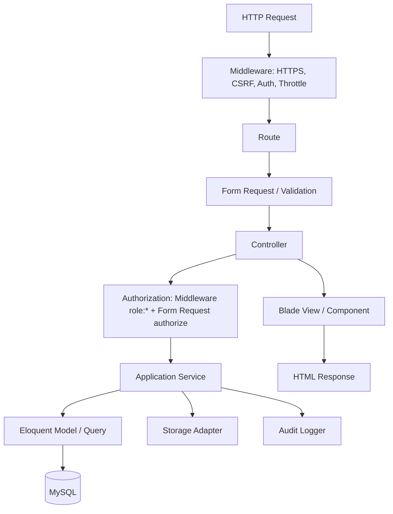
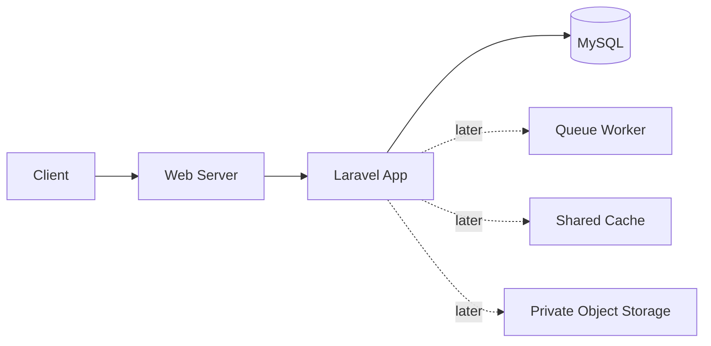

# Architecture Specification
## SuperBie — Lapor Pak Wali (Laravel + MySQL)

- **Architecture style:** modular monolith.
- **Application framework:** Laravel (gunakan versi stabil yang kompatibel dengan PHP yang tersedia; pin versi aktual di `composer.json`).
- **Rendering:** Blade untuk server-rendered HTML; Alpine.js untuk interaksi klien ringan; Tailwind CSS untuk styling. (Livewire **tidak** digunakan pada implementasi ini.)
- **Database:** MySQL, InnoDB, `utf8mb4`.
- **Scope:** Lapor Pak Wali MVP saja.

## 1. Architecture decisions

1. **Laravel monolith** dipilih karena autentikasi, validasi, routing, ORM, migrations, CSRF protection, storage, queues, dan testing tersedia dalam satu ekosistem. Ini mengurangi biaya operasional dan kompleksitas integrasi.
2. **Blade + Alpine.js** dipilih agar formulir dan panel data tetap interaktif tanpa membangun SPA dan API server terpisah. Livewire tidak dipakai; seluruh interaktivitas ditangani Blade + Alpine.js + CSS transitions. **F-18-01 (Prompt 19):** custom client-side SPA engine (`resources/js/spa.js`) yang sebelumnya bertentangan dengan keputusan ini telah **dihapus**. **Prompt 26:** ditambahkan lapisan *progressive internal navigation* (`resources/js/navigation.js`) — pengganti yang disetujui, ringan dan non-SPA: hanya intercept GET internal, swap DOM region shell (`#main-content`, `#primary-navigation`, `#page-heading`, `#page-actions`), dan cache in-memory per-tab yang identity-scoped. Laravel tetap source of truth; tidak ada router/state-framework/Service Worker/penyimpanan persisten. Lihat §9.1.
3. **MySQL/InnoDB** menjadi sumber data transaksional utama. Relasi dan foreign key dipakai untuk menjaga integritas.
4. **Tailwind CSS + CSS keyframes/transitions** menjadi dasar visual. Gunakan satu strategi animasi utama; hindari memasang banyak library animasi yang tumpang tindih.
5. **Laravel session authentication** digunakan untuk panel internal berbasis browser. Tidak perlu JWT untuk alur server-rendered MVP.
6. **Laravel Storage abstraction** untuk lampiran; gunakan private disk untuk file pengaduan.
7. **Monolith dulu, scaling kemudian.** Redis, worker queue khusus, object storage, CDN, dan load balancer baru ditambahkan jika metrik/lingkungan produksi membutuhkannya.

## 2. System context


### Components
- **Browser:** menampilkan halaman publik dan panel internal, menjalankan CSS/JS animasi serta Alpine.js.
- **HTTPS/Web server:** terminasi TLS dan meneruskan request ke Laravel; produksi menggunakan konfigurasi web server yang menunjuk ke direktori `public/`.
- **Laravel:** routing, middleware, controllers, Form Requests, application services, Eloquent, views.
- **Authentication/authorization:** session untuk masyarakat/pelapor dan seluruh akun internal; middleware `auth`; otorisasi berbasis peran via middleware `role:*`/`active` dan `authorize()` di Form Request; rate limiting untuk login, submit, dan tracking. (Tidak ada kelas Policy/Gate terpisah pada implementasi ini.)
- **Role model:** `masyarakat`, `operator`, `admin`, `super_admin`. Masyarakat/pelapor wajib login sebelum membuat laporan. Admin hanya monitoring; Super Admin memiliki akses penuh.
  - Catatan: peran historis `petugas` tidak lagi menjadi active role. Peran operasional penanganan laporan kini dipegang Operator. Data historis yang masih merujuk `petugas` dipertahankan apa adanya sampai ada keputusan bisnis khusus (lihat bagian Historical data).
  - **Operator ↔ Dinas/Unit (FINAL, D-2 / Prompt 21):** satu Operator mewakili **tepat satu** Dinas/Unit (`users.dinas_unit_id`). **Super Admin** adalah actor authoritative yang menetapkan/mengubah Dinas/Unit Operator melalui User Management (`super-admin/users`). Operator tidak boleh self-assign atau mengubah assignment Operator lain; ditegakkan server-side (middleware `role:super_admin` + Form Request `authorize()` + guard di model layer `User::booted() saving`). Operator tanpa unit adalah state valid namun **denied** (tanpa fallback global). Deaktivasi **tidak** menghapus assignment. D-2 tidak menyiratkan batasan tambahan apa pun.
- **MySQL:** data utama pengaduan, akun, kategori, riwayat status, catatan, lampiran metadata, dan audit log.
- **Private storage:** file lampiran di luar akses publik langsung; download melalui route terotorisasi.
- **Logs:** Laravel logging dengan redaksi data sensitif; log bukan pengganti audit log.
- **Email/queue/CDN:** opsional; jangan menjadi dependency MVP kecuali disepakati dan dikonfigurasi.

## 3. Application layering



- **Route:** deklarasi endpoint dan middleware; tidak memuat business logic.
- **Controller:** mengorkestrasi request-response HTTP. Controller harus tipis.
- **Form Request:** validasi dan authorization awal request.
- **Authorization:** middleware `role:*` / `active` pada route + `authorize()` di Form Request (tidak ada kelas Policy terpisah pada implementasi ini).
- **Action/Service:** satu use case atau aturan domain yang bermakna, misalnya `SubmitComplaint`, `TransitionComplaintStatus`, `CreatePublicResponse`.
- **Eloquent/Query layer:** persistence, relasi, scopes, query teroptimasi.
- **Storage adapter:** mengelola file melalui Laravel Storage; tidak menyimpan path dari input user.
- **Audit logger:** menulis event administratif penting tanpa menyimpan rahasia.
- **Blade components:** komponen presentasi reusable dengan semantic HTML dan standar animasi.

## 4. Suggested project structure

```text
app/
  Enums/
    ComplaintStatus.php
    ComplaintNoteVisibility.php
    UserRole.php
  Http/
    Controllers/
      Auth/
      Citizen/
      Staff/
      SuperAdmin/
      DashboardRedirectController.php
    Requests/
    Middleware/
      EnsureUserHasRole.php
      EnsureUserIsActive.php
  Models/
    User.php
    Complaint.php
    ComplaintCategory.php
    ComplaintStatusHistory.php
    ComplaintNote.php
    ComplaintAttachment.php
    AuditLog.php
  Services/
    ...
resources/
  views/
    layouts/
    components/layouts/
    auth/
    public/
    citizen/
    operator/
    admin/
    super-admin/
  css/
    app.css
  js/
    app.js
database/
  migrations/
  seeders/
tests/
  Feature/
  Unit/
```

Adjust the exact structure to the installed Laravel version. Do not create empty abstractions or files only to imitate a pattern.

> **Catatan (Prompt 8):** struktur di atas mencerminkan implementasi aktual. Tidak ada direktori `Actions/`, `Policies/`, atau `Livewire/` pada implementasi ini — business logic multi-langkah berada di `app/Services/`, dan otorisasi memakai middleware `role:*`/`active` + `authorize()` di Form Request. Dokumentasi sebelumnya menyarankan struktur tersebut sebagai aspirasi; ini telah diselaraskan dengan kode nyata.

## 5. Main request flows

### 5.1 Authenticated citizen complaint submission
1. Browser requests the complaint form.
2. Laravel requires an authenticated masyarakat/pelapor session.
3. The UI displays active complaint categories and the related dinas/unit for the selected category.
4. The user submits the complaint; rate limit, daily report limit, and server-side validation run.
   - **Rate limit (Prompt 17):** the submission route is protected by the named limiter `complaint-submission` (5 / 10 min / authenticated user, key = user id). It runs at the route boundary **before** validation, so the 6th attempt within the window returns **HTTP 429** and no complaint is created. Guests are redirected by `auth` first, so they never consume quota.
   - **Daily report limit (business rule):** checked in `StoreComplaintRequest` (5 / calendar day, overridable via `app_settings.daily_report_limit`) and kept independent of the rate limiter.
5. File uploads, if present, are validated and stored on a private disk with generated names.
6. `SubmitComplaint` generates a non-guessable reference and tracking secret.
7. A database transaction creates the complaint and attachment metadata, with the category-linked dinas/unit recorded or resolvable according to the schema.
8. The raw tracking secret is shown once to the user.
9. The response shows a receipt and the related dinas/unit.

### 5.1A Citizen dashboard and history
1. Authenticated masyarakat/pelapor requests the dashboard.
2. Laravel returns only the user's own reports.
3. The user can open a report detail and see allowed status/public response information.

### 5.1B Role-specific internal flows
- Operator: operational report handling — review, category, assignment, status, internal notes, public responses, and attachments, subject to permission.
- Admin: monitoring reports and audit log only.
- Super Admin: full website management, including reports, accounts, roles/permissions, categories, operational configuration, audit and security.

### 5.2 Public tracking
1. User enters reference and required verification.
2. Apply rate limit before lookup.
3. Normalize reference and verify secret/second factor.
4. Return only an explicit public projection of the complaint, not the whole Eloquent model.
5. Use generic errors so an attacker cannot enumerate valid references.

### 5.3 Staff update
1. Request passes session authentication and CSRF.
2. Server-side authorization verifies permission for the requested complaint/action.
3. Request validates the requested status transition and note visibility.
4. In a transaction, update complaint and insert status history/audit record.
5. Return the updated view/state only after commit.

### 5.4 Login (Prompt 20)
1. `POST /login` is a guest route; validation runs first (`email`, `password` required/format).
2. `LoginRequest::authenticate()` calls `ensureIsNotRateLimited()` → on failure (`Auth::attempt` false) it `RateLimiter::hit()`s key `email|ip` and throws a validation error (wrong-credential case stays a **422**-style field error).
3. Threshold = 5 attempts, window = framework default decay (60 s); a success calls `RateLimiter::clear()`.
4. When the threshold is exceeded, the response is **HTTP 429** (`ThrottleRequestsException`, the framework's own 429 exception) with a native `Retry-After` header from `RateLimiter::availableIn()`. The `Lockout` event is dispatched. Invalid input still yields a validation failure, never a 429.
5. Registration and forgot-password abuse limits are **not implemented** — no policy is defined → `DECISION REQUIRED`.

## 6. Authentication and authorization


- Use Laravel's supported session-based web authentication.
- Regenerate session ID after login; invalidate session and regenerate CSRF token at logout.
- Hash passwords using Laravel Hash; never store plaintext.
- Enforce `auth` middleware for staff routes.
- Use roles/permissions only to the level needed. MVP roles: `masyarakat`, `operator`, `admin`, `super_admin`.
- Masyarakat/pelapor wajib memiliki akun dan session login untuk membuat laporan, melihat dashboard, dan melihat riwayat laporan miliknya.
- Operator mengelola proses operasional laporan sesuai permission.
- Admin hanya memiliki akses monitoring laporan dan audit log.
- Super Admin memiliki akses penuh ke fungsi website.

- Enforce authorization on complaint view/update/download actions server-side, not only by hiding buttons (implementasi: middleware `role:*` + `authorize()` di Form Request; bukan kelas Policy terpisah).
- Super Admin account management must prevent privilege escalation and should preserve at least one active administrator.
- Reset password requires a properly configured email provider; otherwise document as unavailable in local MVP.

## 7. Database architecture

- MySQL InnoDB; UTF-8 `utf8mb4`.
- Migrations are the schema source of truth; no manual production-only schema edits.
- Use BIGINT auto-increment primary keys unless a documented public identifier requires a random reference.
- Foreign keys must use deliberate delete behavior. Do not cascade-delete complaint histories/audit evidence when a complaint is deleted.
- Use transactions for complaint creation and status transitions.
- Index only query paths supported by actual screens: reference lookup, status/date list, category filtering, actor/time audit lookup.
- Store times in UTC where feasible; render in the configured application timezone. **FINAL (D-1, Prompt 19):** the authoritative application timezone is `Asia/Makassar` (WITA / UTC+8), bound via `APP_TIMEZONE` and `config('app.timezone')`. Business-rule calendar boundaries (daily report limit) and the retention cutoff follow WITA.
- Backups: automated database backup, restricted access, encryption at rest where supported, retention policy, and periodic restore drills.

## 8. File storage

- Store complaint attachments on a Laravel private disk (local private path for development; private object storage may be introduced later).
- Never expose the private storage path as a public URL.
- Use generated UUID/ULID filenames, validate MIME and extension, enforce size/count limits, and serve through an authorized controller.
- Do not assume a file is safe solely because its extension is allowed.
- Define a malware-scanning step before production if attachment risk/infrastructure requires it.
- `TODO: Define requirement` for approved file types, maximum size/count, retention, and malware scanning.

## 9. Animation and frontend architecture

Every visible UI component must be covered by the animation system, including header, navigation, buttons, links, cards, badges, inputs, labels, validation messages, alerts, modals, tables, pagination, empty states, loading indicators, dropdowns, tooltips, file previews, and page transitions. “Animation” can be a short transition of color, opacity, border, transform, or focus state; it does not mean every element must continuously move.

- Use CSS custom properties for durations/easing.
- Use Alpine.js for stateful micro-interactions and CSS classes for transitions.
- Use IntersectionObserver only for meaningful entrance/reveal effects; avoid scroll-triggered motion on every text line.
- Avoid layout-shifting animations and animations that delay form submission.
- `prefers-reduced-motion: reduce` must disable non-essential movement and replace it with immediate/low-motion state changes.
- Focus indicators must remain visible and cannot be removed for visual polish.
- Loading feedback must not fake progress; success feedback only appears after server confirmation.

### 9.1 Progressive internal navigation (Prompt 26)

A lightweight client-side navigation layer (`resources/js/navigation.js`, bootstrapped once by `resources/js/app.js`) makes internal page changes feel SPA-like **without** turning the app into an SPA. It is a **progressive enhancement**:

- **Server stays the source of truth.** Intercepted links issue a normal `fetch()` GET; Laravel runs the full middleware → authorization → controller → Blade pipeline and returns complete HTML. No JSON API, no client-side router, no client-side authorization.
- **GET only.** Only same-origin `<a>` GET clicks are intercepted. Mutations (POST/PUT/PATCH/DELETE), logout, downloads, external links, `mailto:`/`tel:`, hash-only links, `target="_blank"`, `download`, and any link marked `data-no-navigation` are left to the browser. Laravel PRG, CSRF, validation redirects and flash messages are untouched.
- **Shell swap targets.** The dashboard shell persists; only these server-rendered regions are replaced: `#main-content` (page body), `#primary-navigation` (sidebar menu → server-derived active state), `#page-heading` (title + breadcrumb) and `#page-actions` (header actions). `<title>` is updated from the response.
- **In-memory page cache.** A per-tab `Map` (TTL 60 s, max 10 entries, LRU eviction). **No** `localStorage`, `sessionStorage`, `CacheStorage`, IndexedDB or Service Worker. It is an optimization only — never an authorization layer.
- **Identity-scoped.** Entries are namespaced by a server-derived, non-reversible identity hash rendered in `<meta name="navigation-identity">` (HMAC of user id + role + `dinas_unit_id`, `@auth` only). Guests get no identity → caching is disabled. An identity change (role/unit change, re-login) purges the cache.
- **Conservative caching.** Only safe read-only pages are cached; any page whose `#main-content` contains a non-GET form (a mutation surface) is never cached, and neither are auth, form, or attachment-download paths.
- **No stale-while-revalidate.** A page is served either fresh from the network or from a non-expired cache entry.
- **Fallbacks.** Auth redirects (session expiry), non-HTML responses, non-2xx responses, network/timeout/parse failures, and shell/layout mismatches fall back to a real browser navigation. Native `document.startViewTransition()` is used when available (falling back to a plain swap) and is never required. In-flight requests are aborted on rapid navigation (`AbortController`); prefetch is conservative (primary nav hover/focus, max 2 concurrent).

## 10. Security architecture

| Threat | Mitigation |
|---|---|
| SQL injection | Eloquent/query parameter binding; never concatenate user input into SQL |
| XSS | Blade escaping; sanitize rich text only if rich text is explicitly enabled |
| CSRF | Laravel CSRF middleware for browser state changes |
| Brute force / spam | Rate limit login, submit, tracking; generic errors; monitoring. **Login (Prompt 20):** key `email|ip`, threshold 5, default 60 s decay, hit-on-failure/clear-on-success, `Lockout` event — exceeded → **HTTP 429** with native `Retry-After` (F-18-16). Registration + forgot-password abuse limits are `DECISION REQUIRED` (no policy defined → not implemented). Complaint submission = 5 / 10 min / authenticated user (named limiter `complaint-submission`, key = user id, HTTP 429) — separate from the daily business limit |
| Broken access control | Server-side authorization on every protected operation and private file download (middleware `role:*`/`active` + Form Request `authorize()`) |
| File upload abuse | Allowlist, size/count limits, MIME inspection, generated filenames, private storage |
| Session theft | HTTPS, secure/HttpOnly/SameSite cookies, session regeneration; **F-18-06 (Prompt 19):** password change invalidates other sessions via the `auth.session` middleware + `Auth::logoutOtherDevices()`. `SESSION_SECURE_COOKIE` must be `true` in HTTPS production (env-driven; default off for local HTTP) |
| Data leakage | Explicit public DTO/projection, no internal notes in public views, log redaction |
| Mass assignment | `$fillable`/`$guarded` carefully; validate and map accepted fields |
| Secret leakage | `.env` excluded from version control; never log tokens or tracking secrets |
| Dependency vulnerabilities | Keep Composer/npm lockfiles, audit dependencies, patch regularly |
| Admin misuse | Least privilege, audit events, strong password policy and optional MFA later |

## 11. API and external integration

The MVP primarily uses Laravel web routes, not a separate public REST API. If an API is later required, version it under `/api/v1`, use explicit Resources/DTOs, Form Requests, authorization, pagination, rate limiting, and consistent error responses. Do not expose all database columns by returning Eloquent models directly.

Optional integrations (email/SMS/WhatsApp) must be behind service classes and environment configuration. If no provider is configured, the core complaint flow must still work.

## 12. Performance and caching

- Build/minify CSS/JS using Laravel Vite.
- Optimize images, use responsive sizes, and lazy-load below-the-fold media.
- Paginate staff tables on the server; eager-load relationships to avoid N+1.
- Add indexes after inspecting common query paths and `EXPLAIN`.
- Start without Redis or application cache. Cache public static content only if needed; never cache private complaint data across users.
- CDN is optional and should serve static assets only. Do not cache authenticated HTML or private attachments at a shared edge.
- **Client-side navigation cache (Prompt 26):** the progressive navigation layer keeps a short-lived (60 s), size-bounded (10), identity-scoped **in-memory** `Map` per browser tab. This is a UX optimization only and is never shared across users/roles/units and never becomes an authorization boundary. Authenticated HTML is not made publicly cacheable to enable it. `Cache-Control` policy for authenticated responses (e.g. `private, no-store`) remains `DECISION REQUIRED` (Prompt 25 ADR-25-8).

## 13. Deployment and operations

- Local: PHP, Composer, Node/npm for Vite build, MySQL; gunakan lingkungan Windows/Laragon developer (Laragon menjalankan PHP/MySQL/Node lokal). **Docker bukan jalur utama/aktif pada implementasi ini**; jika file Docker historis masih ada, itu bukan cara menjalankan aplikasi versi ini.
- Production: supported PHP runtime, Composer install with production flags, MySQL, HTTPS, correct web root, writable `storage` and `bootstrap/cache`, configured scheduler/queue only if used.
- Set `APP_DEBUG=false` in production.
- Use separate `.env` per environment; secrets must not be committed.
- Deployment checklist: migrations reviewed, backup created, assets built, health check passed, storage permissions verified, HTTPS enforced, admin seeded securely, logs monitored.
- Monitoring MVP: Laravel logs and web server/database health. External APM is optional.
- Recovery: documented backup and restore procedure tested before launch.
- **Operations runbook (Prompt 23):** `PRODUCTION_OPERATIONS.md` records the operational state using **IMPLEMENTED / REQUIRED / DECISION REQUIRED**. Implemented: `GET /up` health probe, the daily `complaints:purge-expired` schedule, the `database` queue config (no jobs dispatched yet), and a secret-free GitHub Actions CI workflow. **REQUIRED** (host/infrastructure, not this repository): the `schedule:run` trigger, database + attachment backups, a rehearsed restore procedure, and production `.env`. **DECISION REQUIRED** (no value invented): deployment target, scheduler mechanism, backup policy + **RPO/RTO**, monitoring/alerting, trusted proxies (D-6), and the CI platform. CI (`.github/workflows/ci.yml`) runs **build + test only** and never deploys or uses production secrets; no Docker/Kubernetes/Redis/APM/cloud tooling is introduced.

## 14. Scalability path

Start with one Laravel application and one MySQL instance. If usage increases, scale vertically first, optimize queries/indexes, move long-running notifications/file processing to a queue, then consider shared cache, object storage, load balancing, and multiple app instances. These are future options, not MVP dependencies.



## 15. Architecture acceptance checklist

- [ ] Only Lapor Pak Wali is implemented in the MVP.
- [ ] Routes, authorization, validation, business actions, persistence, and views have separated responsibilities.
- [ ] Complaint tracking never exposes private fields or internal notes.
- [ ] Attachments are private and authorized at download.
- [ ] Status update and history are transactional.
- [ ] UI components follow design tokens and animation coverage.
- [ ] Reduced-motion, keyboard access, responsive states, and errors are handled.
- [ ] Automated tests cover happy path, validation, authorization, tracking privacy, and file access.
