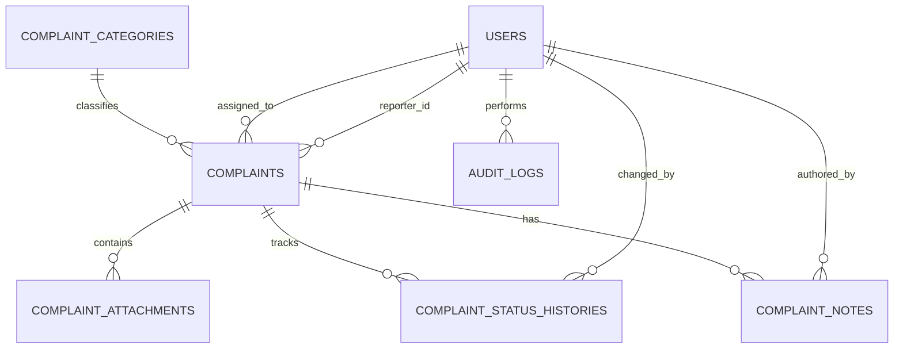

# Data Model & Database Specification
## Lapor Pak Wali MVP — MySQL

This file is the single source of truth for database entities and application-level data contracts. Migrations must implement this document. If an operational rule has not been approved, mark it `TODO: Define requirement` rather than silently turning an assumption into a permanent rule.

## 1. Conventions

- Engine: MySQL with InnoDB and `utf8mb4`.
- Table names: plural `snake_case`; columns: `snake_case`.
- Primary key: `BIGINT UNSIGNED AUTO_INCREMENT` for internal entities.
- Public complaint reference: random opaque string, unique, not derived from ID or personal information.
- Timestamps: `created_at`, `updated_at`; soft deletion only where a real restore workflow is needed.
- Use foreign keys and transactions.
- Store tracking credential as a secure hash; never store raw secret.
- Password hash is managed by Laravel's password hashing.
- Status values in this document reflect the **official complaint lifecycle** finalized per Prompt 3B.

## 2. Entities

| Entity | Purpose | Type |
|---|---|---|
| users | Masyarakat, operator, admin, dan super admin identities | Core/auth |
| complaint_categories | Configurable complaint categories | Supporting |
| complaints | Main public complaint record | Core/business |
| complaint_attachments | Private file metadata | Supporting |
| complaint_status_histories | Immutable status transition history | Audit/business |
| complaint_notes | Internal notes or public responses | Business |
| audit_logs | Sensitive staff/admin action log | Audit |

Masyarakat/pelapor wajib memiliki baris pada `users` dan login sebelum membuat laporan. Dashboard/riwayat hanya menampilkan laporan milik akun tersebut.

## 3. ERD



`assigned_to` is nullable. `changed_by`/`authored_by` may be nullable only if system-generated events are supported; decide consistently in implementation. Masyarakat/pelapor adalah `users` dengan role `masyarakat`; `assigned_to` menunjuk akun internal penanggung jawab operasional (role `operator`) untuk assignment baru. Baris historis yang masih menunjuk akun peran lama (`petugas`) dipertahankan tanpa remap otomatis sampai ada keputusan bisnis khusus.

## 4. Table specifications

### 4.1 `users`
Purpose: authenticated masyarakat/pelapor and internal staff/admin accounts.

| Column | Type | Null | Default | Key/constraint | Notes |
|---|---|---:|---|---|---|
| id | BIGINT UNSIGNED | No | auto | PK | Internal ID |
| name | VARCHAR(120) | No | — | — | Display name |
| email | VARCHAR(255) | No | — | UNIQUE | Normalized email |
| nik | CHAR(16) | Yes | NULL | UNIQUE | NIK 16 digit; wajib bagi masyarakat; **immutable** setelah dibuat; nullable hanya untuk baris lama (Prompt 5B) |
| phone_number | VARCHAR(20) | Yes | NULL | UNIQUE | Nomor HP; format lokal/internasional, dinormalisasi ke `08…`; wajib bagi masyarakat (Prompt 5B) |
| address | TEXT | Yes | NULL | — | Alamat; free text tanpa batas bisnis; wajib bagi masyarakat (Prompt 5B) |
| password | VARCHAR(255) | No | — | — | Laravel password hash |
| role | VARCHAR(30) | No | `masyarakat` | CHECK/app validation | `masyarakat`, `operator`, `admin`, `super_admin` (peran historis `petugas` hanya boleh muncul pada baris lama, bukan nilai baru) |
| dinas_unit_id | BIGINT UNSIGNED | Yes | NULL | FK → dinas_units.id, ON DELETE SET NULL | Operator's Dinas/Unit membership (Prompt 15, BDR-1 = 1a: one Operator → exactly one unit). Only meaningful for `operator`; forced NULL for every other role — enforced at the **model layer** (`User::booted()` `saving` guard, Prompt 21) so no persistence path can bypass it. Assigned/changed **only by Super Admin** via User Management (D-2, Prompt 21). An Operator with NULL here is DENIED all complaints (no global fallback). Deactivation does NOT clear it. A used/removed Dinas/Unit never deletes the account (SET NULL) |
| is_active | BOOLEAN | No | true | — | Inactive users cannot sign in |
| email_verified_at | TIMESTAMP | Yes | NULL | — | Use only if email verification is enabled |
| remember_token | VARCHAR(100) | Yes | NULL | — | Laravel remember-me |
| created_at | TIMESTAMP | Yes | NULL | — | Laravel timestamp |
| updated_at | TIMESTAMP | Yes | NULL | — | Laravel timestamp |

Use Laravel's standard `users` migration conventions where compatible. If role/permission package is later adopted, update this document first.

### 4.2 `complaint_categories`
Purpose: categories available for classifying complaints.

| Column | Type | Null | Default | Key/constraint | Notes |
|---|---|---:|---|---|---|
| id | BIGINT UNSIGNED | No | auto | PK | |
| name | VARCHAR(100) | No | — | — | Display name |
| slug | VARCHAR(120) | No | — | UNIQUE | Stable key |
| description | VARCHAR(500) | Yes | NULL | — | Optional |
| dinas_name | VARCHAR(150) | Yes | NULL | — | Legacy/convenience display label. **NOT a routing source of truth** (Prompt 6 §10). Authoritative Category ↔ Dinas/Unit routing uses the `category_dinas_unit` mapping below (Prompt 5B). |
| is_active | BOOLEAN | No | true | INDEX with is_active where useful | Inactive category unavailable for new submissions |
| sort_order | SMALLINT UNSIGNED | No | 0 | — | Presentation ordering |
| created_at | TIMESTAMP | Yes | NULL | — | |
| updated_at | TIMESTAMP | Yes | NULL | — | |

Official category list: `TODO: Define requirement`. Seed only explicitly approved categories or clearly marked development fixtures.

**Category management (FINAL, Prompt 6):** Super Admin manages categories via `super-admin/kategori` (index/create/store/edit/update/**activate/deactivate**/destroy). Only Super Admin may manage master data (server-side `role:super_admin` + Form Request `authorize()`). Categories are **active/inactive**: an inactive category is rejected server-side for new complaints (never merely hidden in the UI). A category that has **ever been used by a complaint** MUST NOT be hard-deleted — the model layer blocks it and the `DELETE` endpoint returns a redirect + error; Super Admin must **deactivate** it. Deactivating a category **never** alters existing complaints (`category_id`, status, destination, timeline, audit all unchanged). `slug` is a derived, unique, server-generated key (not accepted from request).

### 4.2.1 `dinas_units`

Purpose: official Dinas/Unit entities. **Many-to-many** with categories (FINAL, Prompt 5B).

| Column | Type | Null | Default | Key/constraint | Notes |
|---|---|---:|---|---|---|
| id | BIGINT UNSIGNED | No | auto | PK | |
| name | VARCHAR(150) | No | — | — | Dinas/Unit name |
| code | VARCHAR(50) | Yes | NULL | UNIQUE | Optional stable code |
| description | VARCHAR(500) | Yes | NULL | — | Optional |
| is_active | BOOLEAN | No | true | INDEX | |
| sort_order | SMALLINT UNSIGNED | No | 0 | — | |
| created_at | TIMESTAMP | Yes | NULL | — | |
| updated_at | TIMESTAMP | Yes | NULL | — | |

### 4.2.2 `category_dinas_unit` (pivot)

Purpose: many-to-many mapping Category ↔ Dinas/Unit, managed by Super Admin (`super-admin/kategori/{category}/mapping`, `SyncCategoryMappingRequest`). This pivot is the **current master mapping** — it is **NOT** the complaint's historical destination (that is `complaints.dinas_unit_id`).

| Column | Type | Null | Key/constraint | Notes |
|---|---|---:|---|---|
| id | BIGINT UNSIGNED | No | PK | |
| category_id | BIGINT UNSIGNED | No | FK → complaint_categories.id, ON DELETE CASCADE | |
| dinas_unit_id | BIGINT UNSIGNED | No | FK → dinas_units.id, ON DELETE CASCADE | |
| created_at / updated_at | TIMESTAMP | Yes | — | |

UNIQUE(category_id, dinas_unit_id). Official Dinas/Unit list: `TODO: Define requirement` (not seeded).

### 4.3 `complaints`
Purpose: main complaint data owned by an authenticated masyarakat/pelapor.

| Column | Type | Null | Default | Key/constraint | Notes |
|---|---|---:|---|---|---|
| id | BIGINT UNSIGNED | No | auto | PK | Internal ID |
| reference_code | VARCHAR(32) | No | — | UNIQUE | Random opaque public reference |
| tracking_secret_hash | VARCHAR(255) | Yes | NULL | — | Hash of one-time-displayed secret; nullable only if alternate verification is approved |
| category_id | BIGINT UNSIGNED | Yes | NULL | FK → complaint_categories.id | Nullable until category workflow is confirmed |
| dinas_unit_id | BIGINT UNSIGNED | Yes | NULL | FK → dinas_units.id, ON DELETE SET NULL | ACTUAL Dinas/Unit destination chosen by Operator (Prompt 5C); stored (not dynamic) for historical stability; **NOT derived from `category_dinas_unit`**. Null only when not yet routed. A Dinas/Unit used here cannot be hard-deleted (Prompt 5C.1) |
| assigned_to | BIGINT UNSIGNED | Yes | NULL | FK → users.id, ON DELETE SET NULL | Current assigned staff |
| reporter_id | BIGINT UNSIGNED | No | — | FK → users.id, ON DELETE RESTRICT | Masyarakat/pelapor pemilik laporan |
| reporter_email | VARCHAR(255) | Yes | NULL | — | Snapshot kontak bila dibutuhkan; hindari ekspos publik |
| reporter_phone | VARCHAR(30) | Yes | NULL | — | Optional contact; normalize cautiously |
| title | VARCHAR(180) | No | — | — | Short summary |
| description | TEXT | No | — | — | Complaint details |
| location_text | VARCHAR(255) | Yes | NULL | — | Human-readable location; structured coordinates are out of scope |
| status | VARCHAR(40) | No | `submitted` | INDEX | Official status. See §6 for values and transition matrix |
| public_updated_at | TIMESTAMP | Yes | NULL | — | Last time public-facing status/response changed |
| submitted_at | TIMESTAMP | No | current time | INDEX | Submission time |
| resolved_at | TIMESTAMP | Yes | NULL | — | Set only for approved resolved state |
| created_at | TIMESTAMP | Yes | NULL | — | |
| updated_at | TIMESTAMP | Yes | NULL | — | |

Recommended FK behavior:
- `category_id` → `complaint_categories.id`: `ON DELETE SET NULL` (defensive DB behavior only). **Application layer MUST prevent hard-delete of any Category that has ever been used by a complaint** (Prompt 6 §6) — Super Admin must **deactivate** it. Deleting a *used* Category is blocked at the model layer and via the `DELETE` endpoint; historical complaints always keep their stored `category_id`. Never cascade-delete complaints. Only **unused** Categories may be hard-deleted.
- `dinas_unit_id` → `dinas_units.id`: `ON DELETE SET NULL` (defensive DB behavior only). **Application layer MUST prevent hard-delete of any Dinas/Unit that has ever been used by a complaint** (Prompt 5C.1) — Super Admin must **deactivate** it. Deleting a *used* Dinas/Unit is blocked at the model layer and via the `DELETE` endpoint; historical complaints always keep their stored destination. Never cascade-delete complaints. Only **unused** Dinas/Unit may be hard-deleted.
- `assigned_to` → `users.id`: `ON DELETE SET NULL`.
- Never expose `tracking_secret_hash` or personal contact fields in public responses.

### 4.4 `complaint_attachments`
Purpose: metadata for files held in private storage.

| Column | Type | Null | Default | Key/constraint | Notes |
|---|---|---:|---|---|---|
| id | BIGINT UNSIGNED | No | auto | PK | |
| complaint_id | BIGINT UNSIGNED | No | — | FK → complaints.id, ON DELETE RESTRICT | Preserve records until retention policy is defined |
| disk | VARCHAR(50) | No | `private` | — | Laravel disk name |
| path | VARCHAR(500) | No | — | — | Generated storage path; never user-controlled |
| original_name | VARCHAR(255) | No | — | — | Treat as untrusted display text |
| mime_type | VARCHAR(120) | No | — | — | Server-detected |
| size_bytes | BIGINT UNSIGNED | No | — | — | |
| checksum_sha256 | CHAR(64) | Yes | NULL | — | Optional integrity verification |
| created_at | TIMESTAMP | Yes | NULL | — | |

Allowed extensions, size and count: `TODO: Define requirement`. Never store attachment binaries in MySQL for this MVP.

### 4.5 `complaint_status_histories`
Purpose: append-only record of status transitions.

| Column | Type | Null | Default | Key/constraint | Notes |
|---|---|---:|---|---|---|
| id | BIGINT UNSIGNED | No | auto | PK | |
| complaint_id | BIGINT UNSIGNED | No | — | FK → complaints.id, ON DELETE RESTRICT | |
| from_status | VARCHAR(40) | Yes | NULL | — | NULL for initial status |
| to_status | VARCHAR(40) | No | — | — | Validate allowed values |
| changed_by | BIGINT UNSIGNED | Yes | NULL | FK → users.id, ON DELETE SET NULL | Null for system event only |
| note | VARCHAR(1000) | Yes | NULL | — | Avoid sensitive details |
| created_at | TIMESTAMP | Yes | current time | INDEX with complaint_id | No updated_at; history is append-only |

### 4.6 `complaint_notes`
Purpose: store staff notes and responses separately by visibility.

| Column | Type | Null | Default | Key/constraint | Notes |
|---|---|---:|---|---|---|
| id | BIGINT UNSIGNED | No | auto | PK | |
| complaint_id | BIGINT UNSIGNED | No | — | FK → complaints.id, ON DELETE RESTRICT | |
| author_id | BIGINT UNSIGNED | Yes | NULL | FK → users.id, ON DELETE SET NULL | |
| visibility | VARCHAR(24) | No | `internal` | — | `internal`, `public_response` |
| body | TEXT | No | — | — | Plain text for MVP; escape on output |
| created_at | TIMESTAMP | Yes | current time | INDEX with complaint_id | Append-only in normal UI |

### 4.7 `audit_logs`
Purpose: trace important privileged actions without duplicating full complaint contents.

| Column | Type | Null | Default | Key/constraint | Notes |
|---|---|---:|---|---|---|
| id | BIGINT UNSIGNED | No | auto | PK | |
| actor_id | BIGINT UNSIGNED | Yes | NULL | FK → users.id, ON DELETE SET NULL | Null for system event |
| action | VARCHAR(100) | No | — | INDEX | Stable action key |
| subject_type | VARCHAR(100) | Yes | NULL | — | Allowlisted model/type |
| subject_id | BIGINT UNSIGNED | Yes | NULL | — | Polymorphic reference without polymorphic FK |
| metadata | JSON | Yes | NULL | — | Strict allowlist; never secrets or full PII |
| ip_address | VARCHAR(45) | Yes | NULL | — | Retention/privacy policy required |
| user_agent | VARCHAR(500) | Yes | NULL | — | Truncate; retention policy required |
| created_at | TIMESTAMP | Yes | current time | INDEX | Append-only in application |

## 5. Index strategy

| Table | Index | Purpose |
|---|---|---|
| users | UNIQUE(email) | Login identity |
| complaint_categories | UNIQUE(slug) | Stable category key |
| complaints | UNIQUE(reference_code) | Public tracking lookup |
| complaints | (status, submitted_at) | Staff list/filter |
| complaints | (category_id, submitted_at) | Category list |
| complaints | (reporter_id, submitted_at) | Citizen history/dashboard |
| complaints | (assigned_to, status, submitted_at) | Operator workload |
| complaint_status_histories | (complaint_id, created_at) | Timeline |
| complaint_notes | (complaint_id, created_at) | Complaint detail |
| audit_logs | (actor_id, created_at) | Audit review |
| audit_logs | (action, created_at) | Action review |

Validate indexes against actual queries and `EXPLAIN`; do not add duplicate indexes if a unique constraint already creates one.

## 6. Status and enums

Official status values (7 statuses, finalized per Prompt 3B):

| Code | Public Label | Notes |
|---|---|---|
| `submitted` | Diajukan | Initial status for all new complaints |
| `under_review` | Sedang Ditinjau | Operator is reviewing the complaint |
| `in_progress` | Sedang Diproses | Complaint is actively being worked on |
| `waiting_for_information` | Menunggu Informasi | Operator needs additional information from Masyarakat |
| `resolved` | Selesai | Issue has been handled; public response required |
| `rejected` | Ditolak | Complaint rejected; rejection reason + public response required |
| `closed` | Ditutup | Final. Terminal state — no transitions out. No reopen. |

**Official Transition Matrix (11 allowed transitions):**

| From | Allowed To |
|---|---|
| `submitted` | `under_review` |
| `under_review` | `in_progress`, `waiting_for_information`, `rejected` |
| `in_progress` | `waiting_for_information`, `resolved`, `rejected` |
| `waiting_for_information` | `in_progress`, `resolved` |
| `resolved` | `closed` |
| `rejected` | `closed` |
| `closed` | *(terminal — no transitions)* |

**Explicitly forbidden transitions (representative):**
- `submitted → rejected` (FORBIDDEN)
- `waiting_for_information → rejected` (FORBIDDEN)
- Any transition out of `closed` (FORBIDDEN)

**Authority to change status:**
- Operator: YES
- Super Admin: YES
- Admin: NO (monitoring only)
- Masyarakat: NO

**Additional rules:**
- `rejected` requires: rejection reason (non-empty) + public response (non-empty)
- `resolved` requires: public response (non-empty)
- No reopen workflow. Once `closed`, the complaint is final.
- All status mutations are atomic: status + history + audit in one transaction.

- `users.role`: `masyarakat`, `operator`, `admin`, `super_admin`. Peran historis `petugas` tidak lagi dibuat untuk akun baru; baris lama yang masih bernilai `petugas` tidak diubah otomatis.
- `complaint_notes.visibility`: `internal`, `public_response`.

Prefer VARCHAR plus PHP backed enums/validation for portability and controlled application transitions. Add database CHECK constraints only if supported by the target MySQL version and aligned with migrations.

## 7. Relationships and deletion rules

- Category has many complaints; **do not hard-delete a category referenced by complaints** — the model layer blocks it and the `DELETE` endpoint rejects it (Prompt 6 §6). Deactivate instead; historical complaints keep their `category_id`.
- User may be assigned many complaints; deleting/deactivating a user must not erase complaints. Prefer deactivation; FK can set assignment null.
- Dinas/Unit has many users (Operators) via `users.dinas_unit_id`; removing a master Dinas/Unit sets that column to NULL (never cascade-delete the account). The account simply loses scope until reassigned (Prompt 15). **Assignment lifecycle (FINAL, D-2 / Prompt 21):** an Operator's `dinas_unit_id` is assigned/changed **only by Super Admin** through User Management; a non-`operator` role always persists NULL (model-layer guard); deactivation does not clear the assignment.
- **Operator complaint visibility (FINAL, Prompt 15, BDR-1 = 1a, BDR-2 = 2c hybrid):** an Operator sees a Complaint iff `users.dinas_unit_id IS NOT NULL` AND (`complaints.dinas_unit_id = users.dinas_unit_id` OR (`complaints.dinas_unit_id IS NULL` AND the complaint's category is mapped to that unit via `category_dinas_unit`)). An Operator with no unit sees nothing (denied, no global fallback). Super Admin is GLOBAL and unscoped.
- Complaint has many attachments, status histories, and notes.
- Complaint deletion is not available in normal MVP UI. **Retention (FINAL, Prompt 5B.1):** a complaint is permanently deleted **5 years after `complaints.submitted_at`** by the backend command `complaints:purge-expired` (scheduler-driven). Deletion removes `complaints` plus child rows `complaint_status_histories`, `complaint_notes`, `complaint_attachments` (and their physical private files), and complaint-related `audit_logs` (`subject_type='complaint'`, matching `subject_id`). Users and master data (`complaint_categories`, `dinas_units`, `category_dinas_unit`) are **never** removed by retention. `submitted_at IS NULL` is never treated as expired (and the column is `NOT NULL` in practice).
- Audit records are not cascaded away with the entity they refer to — **except** complaint-related audit logs, which the FINAL retention rule explicitly deletes together with their complaint (Prompt 5B.1). Unrelated audit logs are always preserved.

## 8. Validation contract

| Field | Rule | Notes |
|---|---|---|
| title | required string, max 180 | Trim whitespace; reject empty-after-trim |
| description | required string | Maximum length to be configured; do not accept unbounded payload |
| reporter_id | required authenticated user id for masyarakat/pelapor | Must match logged-in account |
| reporter_name | optional snapshot string, max 120 | Source is authenticated profile |
| reporter_email | optional valid email, max 255 | Normalize |
| reporter_phone | optional string, max 30 | Format/requiredness TODO |
| location_text | nullable string, max 255 | No coordinates in MVP |
| reference_code | generated server-side | Never accept from public form |
| status | enum allowlist + transition rules | Never trust arbitrary client status |
| visibility | `internal` or `public_response` | Only authorized staff can create |
| file | approved MIME/extension, size/count limits | Values TODO; validate server-side |

## 9. Public tracking data contract

Return only a whitelist, for example:

```json
{
  "reference_code": "LPW-EXAMPLE-RANDOM",
  "status": "under_review",
  "status_label": "Sedang ditinjau",
  "submitted_at": "ISO-8601 timestamp",
  "public_updated_at": "ISO-8601 timestamp",
  "public_responses": []
}
```

This is an illustrative shape, not a real record. Do not include reporter contact details, `tracking_secret_hash`, internal notes, private file paths, staff email, audit data, or full model serialization.

## 10. Citizen account and submission limit

- Masyarakat/pelapor must be authenticated before complaint creation.
- Complaint ownership is determined by `reporter_id`.
- Dashboard and history queries must be scoped to the authenticated `reporter_id`.
- A daily complaint limit applies per masyarakat/pelapor account. Numeric value: `TODO: Define requirement`.
- The limit must be enforced server-side and surfaced with a human-readable message.
- **Complaint submission rate limit (FINAL, Prompt 17, security/abuse protection — NOT a business rule):** 5 submissions / 10 minutes / authenticated user → **HTTP 429** when exceeded. Enforced by the named Laravel rate limiter `complaint-submission` applied via `throttle:` middleware on the submission route only; scope key = authenticated user id (never the client IP); a submission with any number of attachments counts as **one** submission. This is **separate** from, and never replaces, the daily business limit. Source of truth: `config/business_rules.php` (`complaint_submission_rate_limit`, `complaint_submission_rate_window_minutes`).

## 11. Transaction requirements

- Complaint submission + attachment metadata + initial status history must either all commit or all roll back.
- Status update + history + audit record must be atomic.
- If file storage succeeds but DB transaction fails, remove orphaned file(s) using compensating cleanup.
- Never perform a status update without writing its history record.

## 12. Seed data and migrations

- Seed roles only if represented in a separate role table; this schema uses a `users.role` field initially.
- Create one development-only admin account through environment-controlled seeding or a documented command. Never commit a production password.
- Category seed values require approval; if using fixtures, mark them clearly as demo data.
- Migrations must be reversible where practical, ordered by FK dependencies, and tested on a clean database.
- Production migrations run from version-controlled files after backup and review.

## 13. TODOs before production

- Confirm required identity fields for masyarakat/pelapor account.
- Confirm official categories, dinas/unit mapping, and assignment model.
- Confirm official status lifecycle and allowed transitions. **DONE — finalized per Prompt 3B.**
- Confirm tracking verification and data visible publicly.
- Confirm file types, max size/count, retention, malware scanning.
- Confirm privacy/retention policy for PII, IP addresses, user agents, audit metadata.
- Confirm whether notifications are required and which provider is approved.
- Confirm whether permissions need finer granularity beyond operator/admin/super_admin.
- Confirm how historical rows that still reference the legacy `petugas` role should be treated (retain, reassign, or archive) — no automatic remap is performed.
